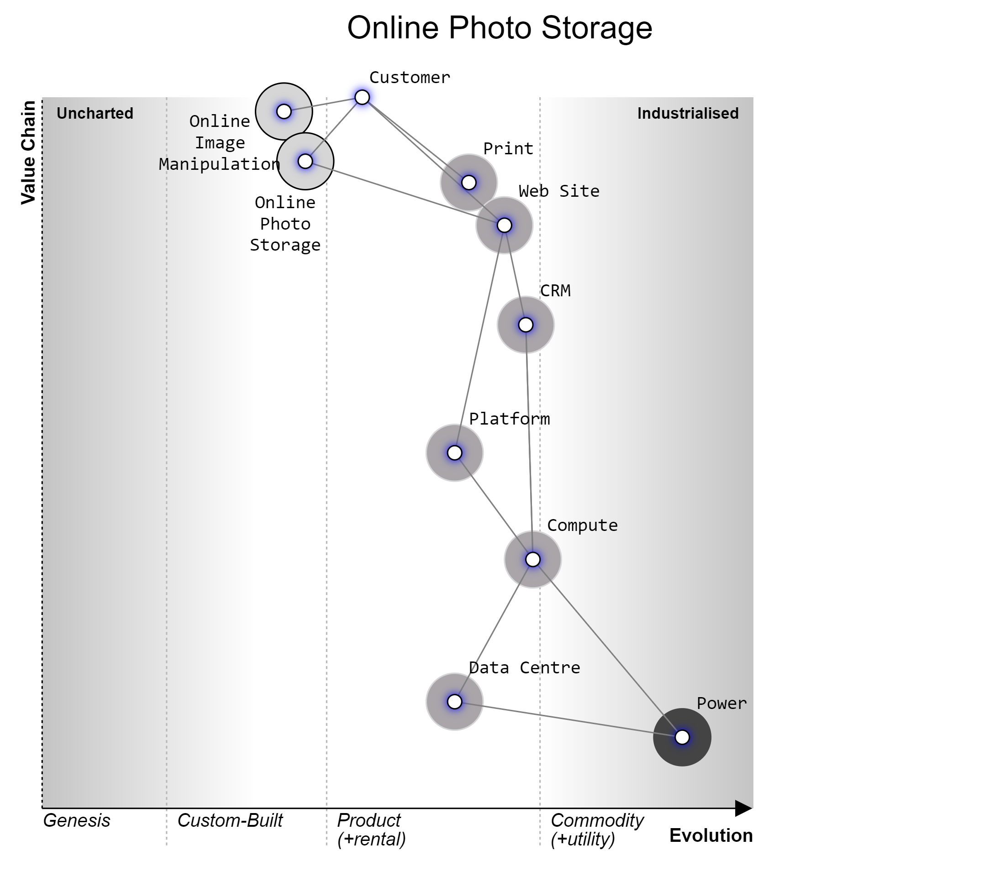

# Value Chain Map

## Introduction

## Example

A ValueChainMap.wm file is included with this repository. 

If you are using VsCode, the [Wardley Maps Extension](https://marketplace.visualstudio.com/items?itemName=damonsk.vscode-wardley-maps) will render and export the map.

You can then include the rendered png like so:

